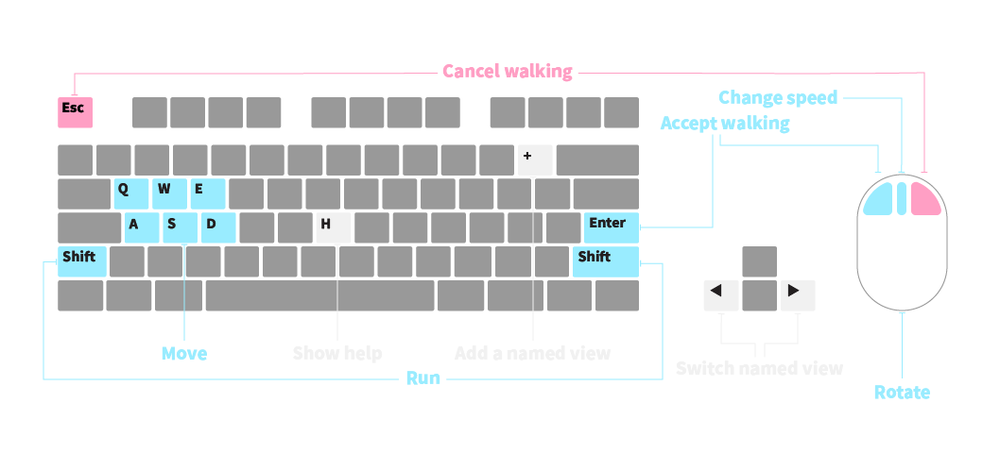

# About

A game-like walk navigation plugin for Rhinoceros. Only Supports Windows.

# Links

- Video: https://youtu.be/WBIxDFxskGQ
- Installer: https://www.food4rhino.com/en/app/walkie
- Source code: https://github.com/cunarist/walkie

# Installation

- Download it from Rhino's package manager with command `PackageManager`.
- Altenatively you can also download it from the installer link above

# Usage

Use the command `WASD`. Also, it is strongly recommended to make middle mouse button activate the macro `WASD` in Rhino options.

