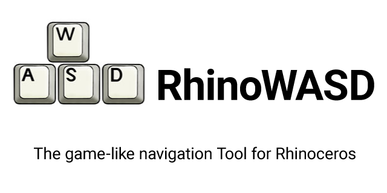

# Installation
Run the RhinoWASD.rhi to install the plugin. Optionally you can also manually place the RhinoWASD.rhp in your preferred location and drop it onto the Rhinoceros main Window, to install the plugin.

# Usage
1. Type `WASD` on the commandline and press enter. You should see a screen overlay showing the hotkeys and mouse commands you can use with wasd.

1. Press `ESCAPE` to stop the behaviour and get back to the usual Rhinoceros 3D Navigation

# Extras
The command `Screenshot` is an extra command, which you can use from either the command line directly or while in WASD mode trough `F12`.
When the command is started from the command line you can choose betreen different options. These options will be saved and can therefore be used during the WASD mode as well.